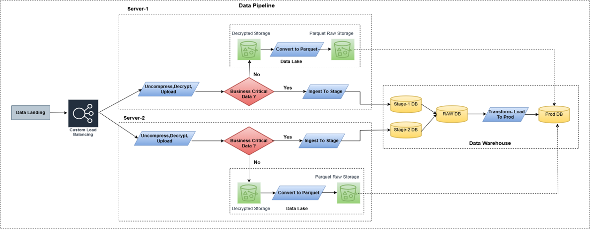

# Hybrid DWH and Data Lake Architecture
This project implements a hybrid data architecture that combines both traditional data warehousing and modern data lake capabilities.

Structured and business-critical data is transformed and loaded into the enterprise data warehouse (DWH) for reporting, analytics, and compliance. 
At the same time, semi-structured and high-volume raw data is ingested into an AWS-based data lake for flexible exploration, machine learning, and long-term storage. 

This architecture ensures scalability, performance, and cost-efficiency, enabling multiple downstream use cases including BI dashboards, ad-hoc querying, and advanced analytics.

## Ingestion Load Distribution

